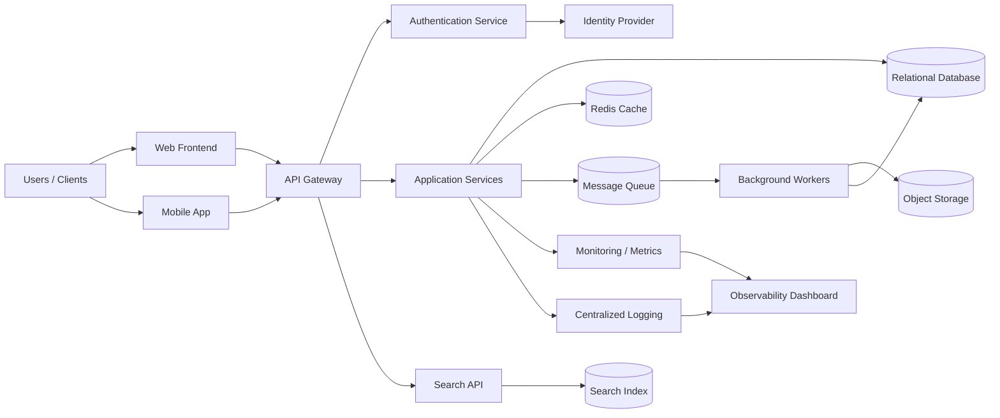

# Architecture Overview

```mermaid
flowchart LR
    User[Users / Clients] --> Web[Web Frontend]
    User --> Mobile[Mobile App]

    Web --> Gateway[API Gateway]
    Mobile --> Gateway

    Gateway --> Auth[Authentication Service]
    Gateway --> App[Application Services]
    Gateway --> Search[Search API]

    App --> DB[(Relational Database)]
    App --> Cache[(Redis Cache)]
    App --> Queue[(Message Queue)]
    Search --> Index[(Search Index)]

    Queue --> Worker[Background Workers]
    Worker --> Storage[(Object Storage)]
    Worker --> DB

    Auth --> IdP[Identity Provider]
    App --> Metrics[Monitoring / Metrics]
    App --> Logs[Centralized Logging]

    Metrics --> Dashboard[Observability Dashboard]
    Logs --> Dashboard
```
