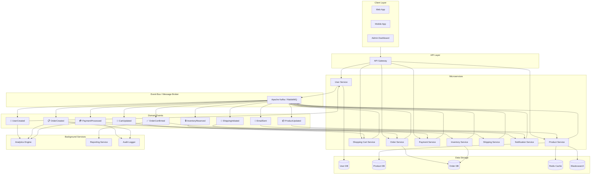

# E-Commerce Event-Driven Architecture

This diagram illustrates an event-driven architecture for an e-commerce platform where services communicate asynchronously through events.

## Architecture Diagram

## Event Flow Example: Order Placement

1. **OrderCreated** - Customer places order via API
2. **PaymentProcessed** - Payment Service confirms payment
3. **InventoryReserved** - Inventory Service reserves stock
4. **OrderConfirmed** - Order Service confirms order
5. **ShippingInitiated** - Shipping Service picks and packs
6. **EmailSent** - Notification Service sends confirmation email
7. **Analytics** - Analytics Engine tracks conversion

## Benefits

- **Decoupling**: Services don't directly call each other
- **Scalability**: Each service can scale independently
- **Resilience**: Services can fail without cascading failures
- **Auditability**: Complete event log for compliance
- **Real-time Updates**: Clients get notifications via WebSockets/polling
